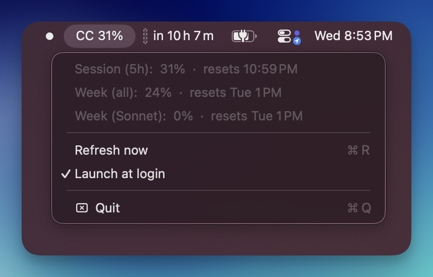

# ClaudeUsageBar

A tiny macOS menu bar app that shows your Claude Code usage limits — the same numbers as `/usage`, without opening a session to check.



The number in the bar is whichever limit is closest to capping you (max across your session and weekly buckets). At 80%+ it shows a ⚠️.

## Install

Requires macOS 13+, Xcode Command Line Tools (`xcode-select --install`), and a logged-in [Claude Code](https://claude.com/claude-code).

```sh
git clone https://github.com/k-hess/claude-usage-bar.git
cd claude-usage-bar
make install
```

That builds the app, installs it to `/Applications`, and launches it. On first run macOS asks to let ClaudeUsageBar read the `Claude Code-credentials` Keychain item — click **Always Allow**. (If you rebuild later, macOS re-prompts: the ad-hoc code signature changes with every build.)

Turn on **Launch at login** from the dropdown if you want it to survive reboots.

## How it works

- Reads the OAuth token Claude Code already stores in your macOS Keychain. No separate login, no API key to configure.
- Calls `GET https://api.anthropic.com/api/oauth/usage` — the endpoint behind `/usage` — every 5 minutes, plus on demand via **Refresh now**.
- Renders whichever limit buckets your plan has (session 5h, weekly all-models, weekly Opus/Sonnet). Buckets the API returns as null are hidden.

If the token expires (401), the bar shows `CC –` with "Token stale — open Claude Code to refresh" in the dropdown. Claude Code rotates the token whenever it runs, so it self-heals the next time you use it.

## Security notes

Worth being explicit, since this app touches your Claude credentials:

- The token is read from the Keychain into memory and sent to exactly one place: `api.anthropic.com`, over HTTPS, in the `Authorization` header.
- It is never logged, never written to disk, never placed in a URL.
- There is no telemetry, no analytics, and no other network call. The whole app is one Swift file — [read it](Sources/ClaudeUsageBar/main.swift).

## Uninstall

```sh
make uninstall
```

Then remove the Keychain access grant if you like (Keychain Access → search "Claude Code-credentials" → Access Control).

## License

[MIT](LICENSE)
